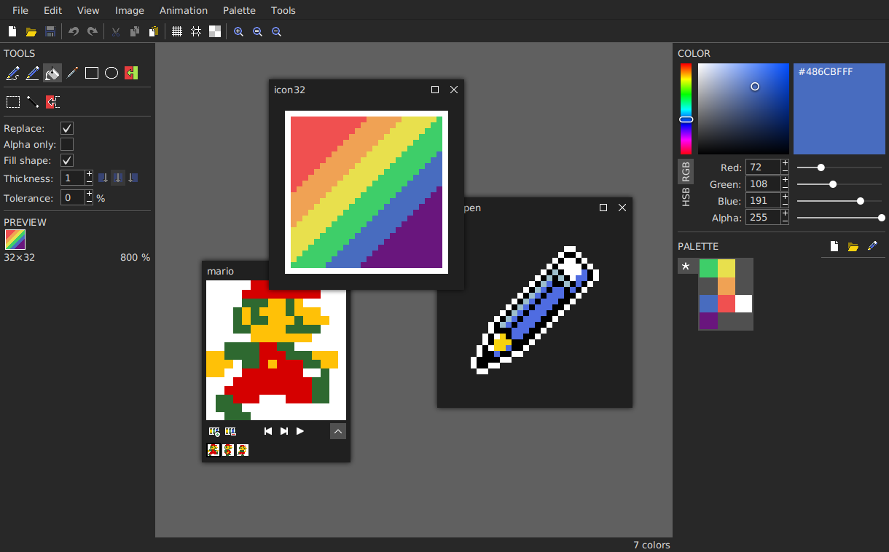

# Pixelator

The lovingly hand-crafted graphics editor for pixel art.

Pixelator is intuitive and easy to use while providing powerful tools that will make your daily work faster and more fun.

Absolutely free and open-source.

## Features

All the tools you need:
* Pen
* Draw Line
* Fill
* Pick Color
* Draw Rectangle
* Draw Ellipse
* Fill Color
* Select
* Magic Wand
* Select Color

Powerful Tool Configurations:
* Replace
* Alpha only
* Fill shape
* Thickness
* Tolerance

All-in-one Color Picker:
* Graphical selection
* Selection by Hex Code
* Supports RGB and HSB

## Preview Features

Powerful Palette Editor
* Automatically generate Palettes from any image
* Save, load and edit Palettes just like images
* Change Palette of an existing image interactively

Animations
* Work on animated and still images in parallel
* Seamlessly transform still images into animations and vice versa

## Installation

1. Download current pixelator.jar at https://github.com/Calabiyaur/Pixelator/releases/latest
2. Run pixelator.jar

Windows:

Double-click pixelator.jar

Linux:

> java -jar pixelator.jar

## Manual Build

1. Build with IntelliJ
2. mvn package
3. JAR with dependencies can be found at ./target/pixelator-X.X.X.jar
